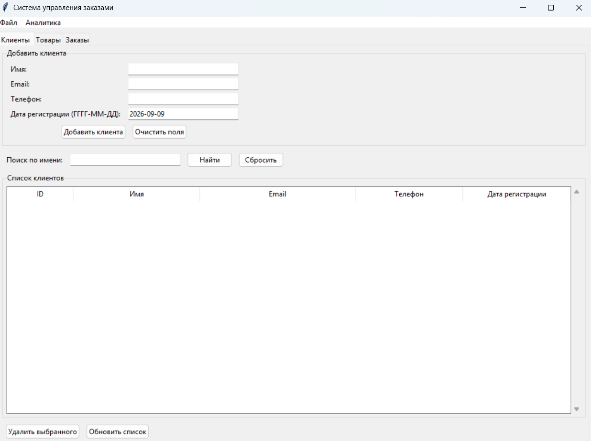
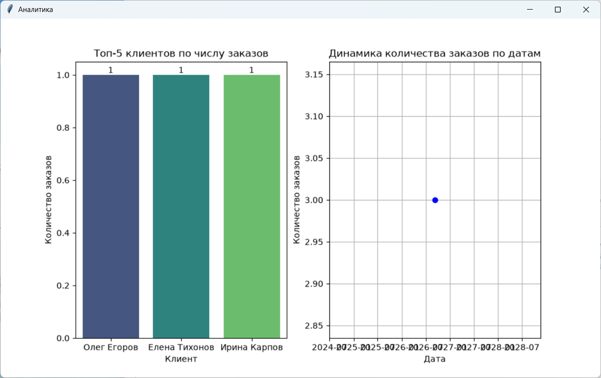

# Система учёта заказов

Приложение для менеджеров интернет-магазина. Управление клиентами, товарами, заказами, аналитика, экспорт/импорт данных в CSV и JSON. Проект выполнен в рамках итоговой аттестации по Python.

## Установка и запуск

Для работы приложения требуется Python 3.8 или выше. Склонируйте репозиторий или скачайте исходный код. В корневой папке проекта дважды кликните по файлу run.bat – это запустит приложение и автоматически создаст папку для базы данных. Если вы предпочитаете ручной запуск, откройте терминал в папке проекта, установите зависимости командой pip install -r requirements.txt и запустите приложение командой python main.py.

## Структура проекта

Проект организован следующим образом: в папке src находятся все основные модули – models.py с классами данных, db.py для работы с SQLite, gui.py с графическим интерфейсом на tkinter, analysis.py для визуализации и аналитики, utils.py со вспомогательными функциями. В корне лежат main.py – точка входа, run.bat для быстрого запуска в Windows, generate_test_data.py для генерации тестовых данных, requirements.txt со списком зависимостей, .gitignore и README.md. Папка data содержит базу данных SQLite, папка screenshots – скриншоты интерфейса, папка tests – юнит-тесты.

## Описание модулей

Модуль models.py содержит абстрактный базовый класс Entity и наследников Client, Product, Order. Реализована инкапсуляция через свойства, полиморфизм через метод to_dict, наследование от Entity. Модуль db.py предоставляет класс DatabaseManager для подключения к SQLite, создания таблиц, выполнения CRUD-операций для клиентов, товаров, заказов и позиций заказов. Модуль gui.py реализует главное окно на tkinter с тремя вкладками – Клиенты, Товары, Заказы. Интерфейс включает формы добавления, таблицы с данными, поиск клиентов по имени, фильтрацию заказов по дате, сортировку по дате и сумме (с использованием собственной рекурсивной быстрой сортировки), а также меню для экспорта и импорта CSV и JSON, очистки всех данных и вызова аналитики. Модуль analysis.py содержит функции для анализа данных – get_top_clients возвращает топ-5 клиентов по числу заказов, get_orders_dynamics возвращает динамику заказов по датам. Графики строятся с помощью matplotlib и seaborn, а show_analysis_window открывает отдельное окно tkinter с двумя графиками. Модуль utils.py включает функции validate_email и validate_phone для проверки email и номера телефона с помощью регулярных выражений, функции export_to_csv, import_from_csv, export_to_json, import_from_json для работы с файлами, а также функцию sort_orders, реализующую рекурсивную быструю сортировку с использованием лямбда-выражений.

## Тестирование

Для запуска юнит-тестов, которые покрывают модули models.py и analysis.py, откройте терминал в корневой папке проекта и выполните команду python -m unittest discover tests. При успешном прохождении всех тестов вы увидите сообщение OK.

## Генерация тестовых данных

Для быстрого наполнения базы данных случайными клиентами, товарами и заказами используйте скрипт generate_test_data.py. Он генерирует JSON-файл с фиктивными данными, который затем можно импортировать через меню приложения. Запустите скрипт командой python generate_test_data.py. После выполнения появится файл big_data.json в корневой папке. В приложении выберите в меню Файл – Импорт из JSON и укажите этот файл – данные автоматически загрузятся в базу. В начале скрипта находятся настройки – вы можете изменить количество клиентов (NUM_CLIENTS), товаров (NUM_PRODUCTS), заказов (NUM_ORDERS) и имя выходного файла (OUTPUT_FILE).

## Скриншоты

  
*Главное окно приложения с вкладками Клиенты, Товары, Заказы.*

  
*Окно аналитики с графиками топ-5 клиентов по числу заказов и динамики заказов по датам.*

## Системные требования

Для работы приложения требуется Python 3.8 или выше. Все необходимые библиотеки перечислены в файле requirements.txt и включают pandas, matplotlib, seaborn, networkx. Установка зависимостей выполняется командой pip install -r requirements.txt.